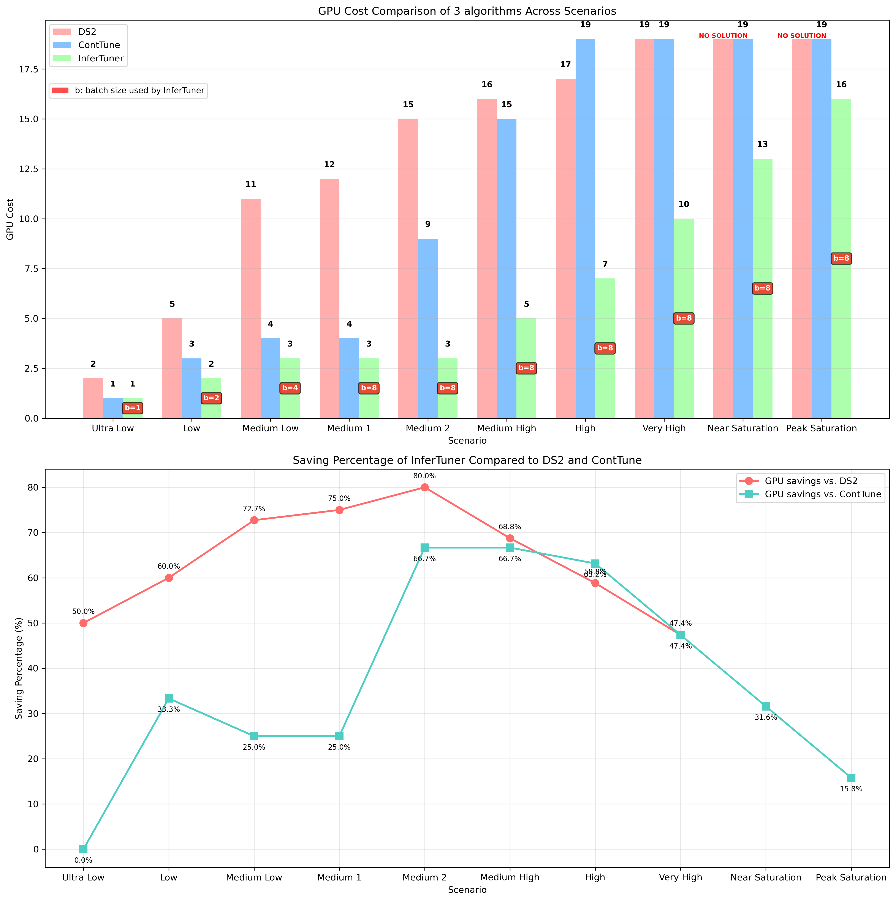

[//]: # (# InferTuner 实验报告)

不同算法(DS2, ContTune)与 InferTuner 在GPU资源节约效果的对比实验

#### 实验内容：

对于同一份访问请求日志(模型:Falcon3-7B-Instruct, 请求间隔:1000ms, 并行度:[1, 19], batch_size: [1, 2, 4, 8], 每个节点处理1个batch)，分别使用 DS2、ContTune 和 InferTuner 三种算法寻找最优的GPU成本，比较它们在 GPU 资源节约效果上的差异。

#### 实验配置：

约定两种服务指标：
- 吞吐量(throughput): 平均每秒完成的推理请求数，单位为 req/s
- 延迟(latency): 平均每个请求从到达系统到完成的时间，单位为 ms

共设计10个实验场景，代表不同的系统负载及其服务质量要求：

| 场景名称            | 目标吞吐量(req/s) | SLO(ms) |
|-----------------|--------------|---------|
| Ultra Low       | 0.17         | 12000   |
| Low             | 0.5          | 14000   |
| Medium Low      | 0.8          | 16000   |
| Medium 1        | 1.0          | 18000   |
| Medium 2        | 1.2          | 20000   |
| Medium High     | 1.4          | 22000   |
| High            | 1.5          | 25000   |
| Very High       | 1.6          | 30000   |
| Near Saturation | 1.69         | 38000   |
| Peak Saturation | 1.78         | 48000   |

("极低负载场景", 0.17, 12000),
("低负载场景", 0.5, 14000),
("中低负载场景", 0.8, 16000),
("中负载场景(小批量)", 1.0, 18000),
("中负载场景(大批量)", 1.2, 20000),
("中高负载场景", 1.4, 22000),
("较高负载场景", 1.5, 25000),
("高负载", 1.6, 30000),
("接近饱和负载", 1.69, 38000),
("峰值/饱和负载", 1.78, 48000),

#### 实验结果：

#### 实验结论

从图中可以看出，InferTuner 在 GPU 资源节约方面表现优异，整体优于 DS2 和 ContTune，在部分条件约束下显著更优。需要注意的是，在 `Very High` 及其之后的场景中，DS2及ContTune均把资源放大到了最大值，若系统内还有其余GPU,GPU用量应当会更多，InferTuner 的省卡效果也会更明显。
